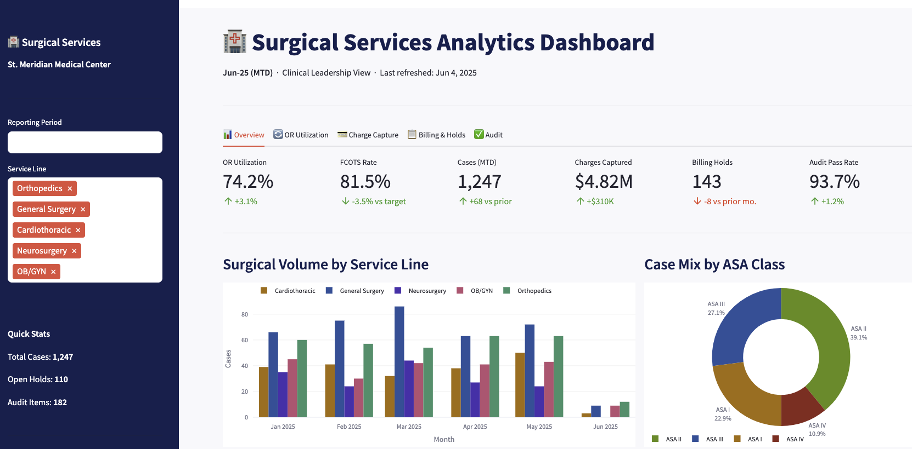
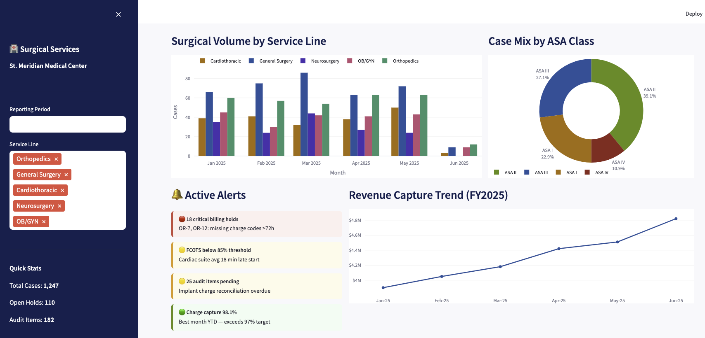
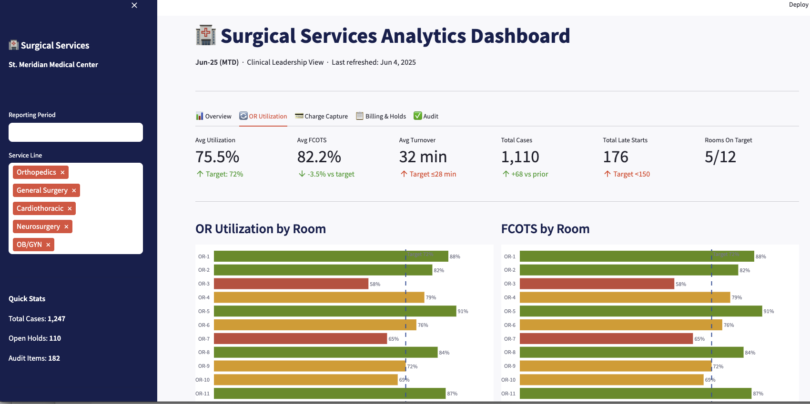
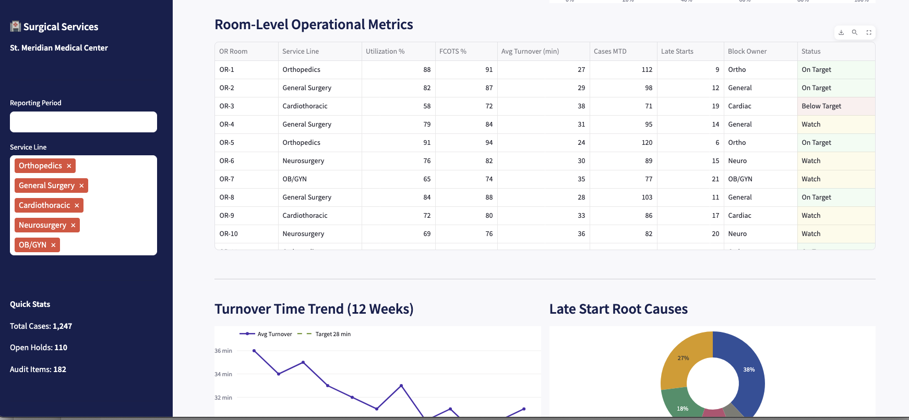
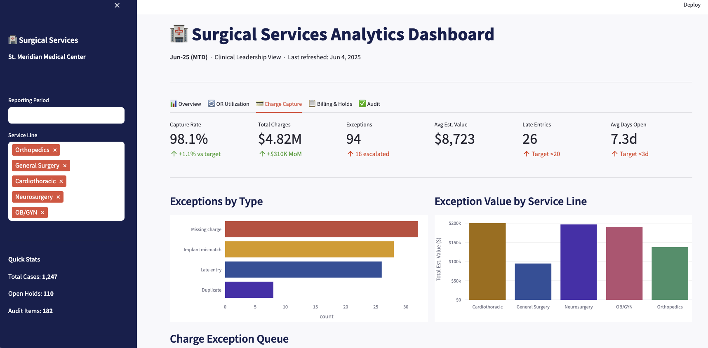
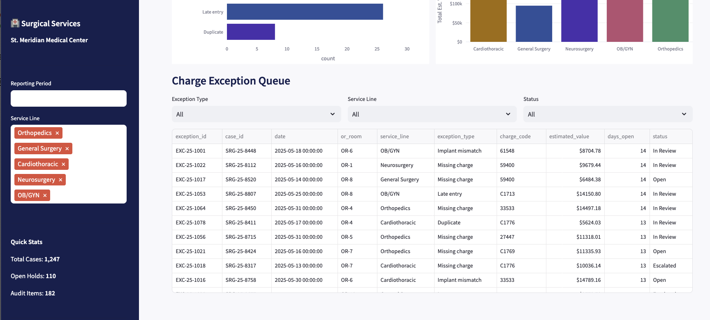

# surgical-dashboard

## Dashboard POC for a surgical services domain

## sample datasets (dummy)
## created using streamlit, python
## libraries used: 
### streamlit, pandas, plotly, openpyxl

